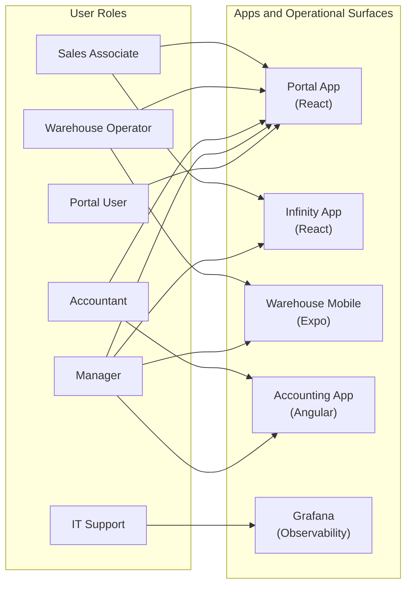
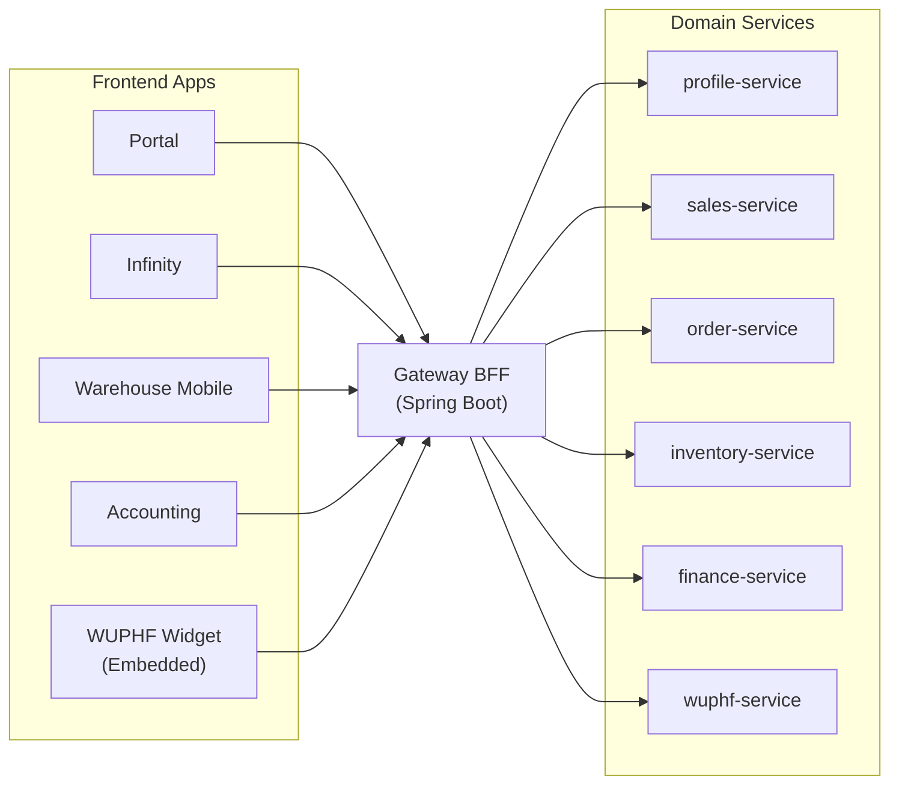
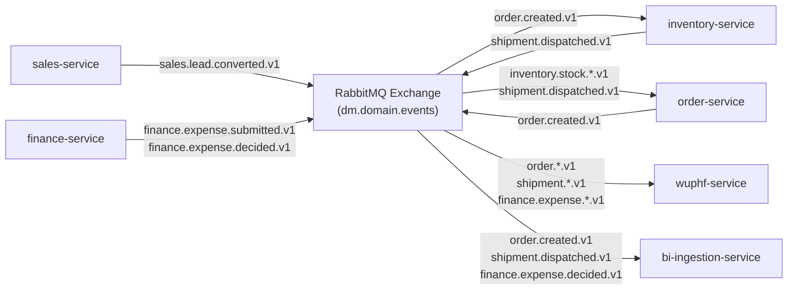
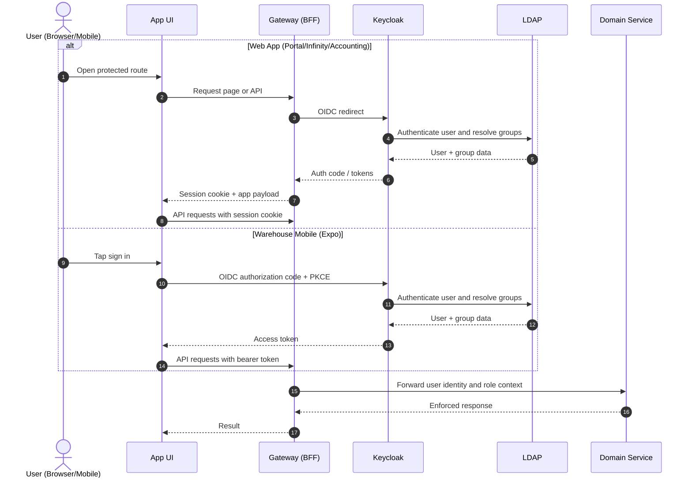
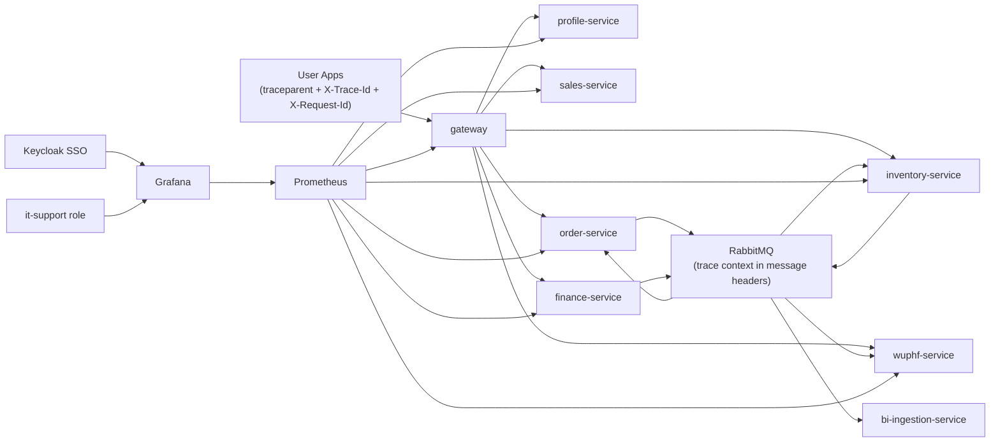
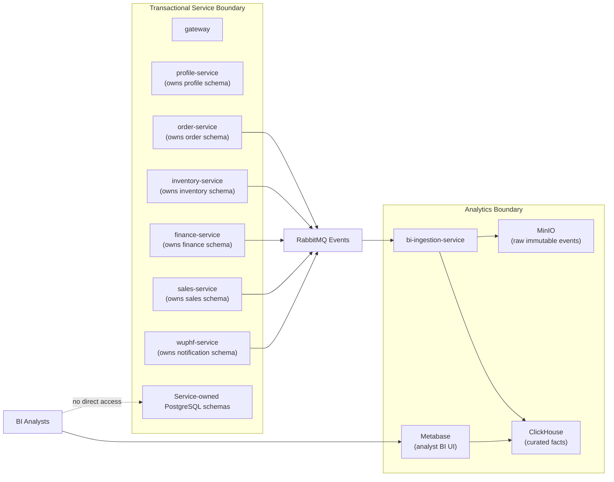
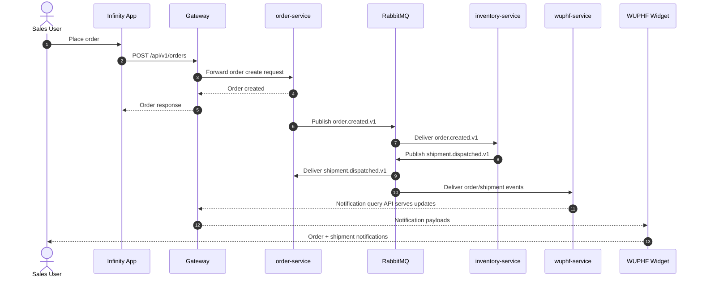

# Dunder Mifflin System Interaction Diagrams

This document provides a visual map of user roles, app/service communication, auth integration, observability flow, and BI boundary patterns.

## 1. User Roles -> App Access

## 2. App -> Gateway -> Services (Synchronous Path)

## 3. Service-to-Service Communication (Asynchronous/Event-Driven)

## 4. Authentication and Authorization Integration

## 5. Observability Integration

## 6. Data Ownership and BI Decoupling Boundary

## 7. End-to-End Order-to-Dispatch-to-Notification Flow

